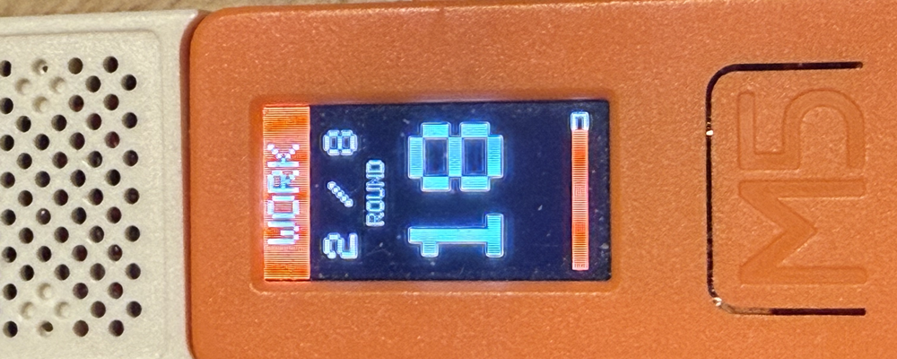

# M5StickC Tabata Timer

A high-visibility, smooth-performance Tabata training timer designed for M5StickC and the Speaker HAT.



## Features

- **Smooth Rendering:** Implements double buffering (TFT_eSprite) to completely eliminate screen flickering.
- **Precision Audio Feedback:** Countdown (3, 2, 1) and start/stop tones are perfectly synchronized with the visuals. Includes a **Grand Fanfare** upon completing all sets.
- **Modern UI:**
  - Color-coded header bars for each state (WORK/REST/PREP).
  - Smooth progress bar indicating remaining time.
  - Timer digits turn red during the final 3 seconds of a set.
  - **High-Visibility Round Display:** Large round indicator (e.g., 8 / 8) easily readable during intense exercise.
- **Snappy Transitions:** Instant state switching when the timer hits zero. Skips the final rest period after the last set for an immediate finish.

## Hardware Requirements

- **Main Unit:** M5StickC (or M5StickC Plus/Plus2 - code adjustments may be required)
- **Extension:** M5Stack Speaker HAT

## How to Use

1.  **Boot:** Power on the device to see the "READY" screen.
2.  **Start:** Press the large front button (**Btn A**) to start with a 5-second preparation (PREP) period.
3.  **Pause:** Press **Btn A** during training to pause the timer.
4.  **Reset:** Press the side button (**Btn B**) on the "DONE" screen or while paused to return to the "READY" screen.

## Timer Settings

You can adjust the intervals by modifying the constants in the code:

```cpp
const int WORK_TIME = 20; // Work interval in seconds
const int REST_TIME = 10; // Rest interval in seconds
const int PREP_TIME = 5;  // Initial preparation time
const int ROUNDS = 8;     // Total number of sets
```

## Installation

1.  Set up the Arduino IDE or `arduino-cli`.
2.  Install the `M5StickC` library.
3.  Open `TabataTimer.ino` and upload it to your M5StickC.

---

### Troubleshooting

**Upload Errors:**
- Ensure the correct serial port is selected.
- If you see `Connecting...`, **press and hold the M5 button (front button)** to enter bootloader mode.

**No Sound:**
- Check if the Speaker HAT is firmly seated in the header.
- Check the small volume dial on the side of the Speaker HAT.

## License

MIT License
